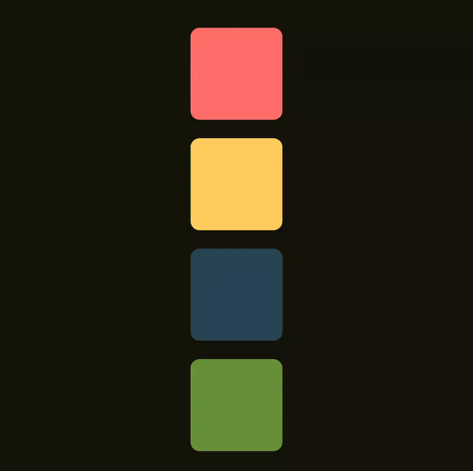

## Compose Layout Playground

This is a demo or playground project to experiment with various layout functionalities of Jetpack Compose.

## Topics

Examples related to these topics are included:

- Intrinsic measurements
- Layout modifier
- Modifier chaining
- Lookahead
- Some of the official Lookahead samples

### Demo

#### Simple lookahead with movable content

Blog post
explaining `Lookahead`: [Animations with Lookahead in Jetpack Compose](https://medium.com/@pushpalroy2007/animations-with-lookahead-in-jetpack-compose-60423fe0d1a7)

The blog is also available on
Hashnode [here](https://blog.pushpalroy.com/animations-with-lookahead-in-jetpack-compose).

#### Container transform animation with lookahead

